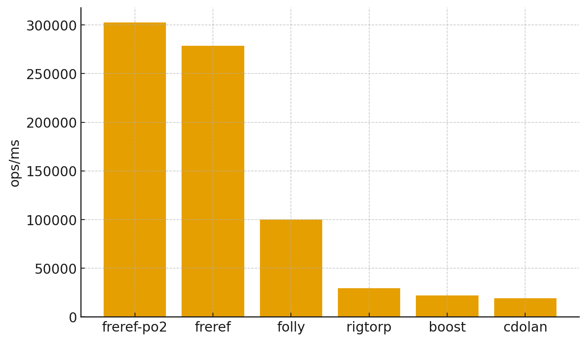

# spsc-queue-benchmark
Benchmarking suite for various single producer single consumer (SPSC) queue implementations. Feel free to add more implementations and open a PR.
> [!NOTE]
> This project exists to support [my SPSC queue implementation in Zig](https://github.com/freref/spsc-queue).
# Results
The benchmarks were run on a MacBook Pro (Apple M4 Pro, 14 cores: 10 performance + 4 efficiency) with 48 GB unified memory.

